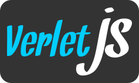

<!-- # Verlet.js -->



*Verlet.js* is a javascript library for creating rapid and fast **verlet physics** based models and structures.. Its API Is Amazing....check this out..

> **``The Awsome API``**

> **``You can create a cloth in just 3 lines of javascript``**

# Lets Get Started

## Create A Cloth In Just ***3 Lines Of Code***
```javascript
  Verlet().quickSetup(function(dots,cons) {
    this.Poly.cloth({},dots,cons)
  })
```

<hr>

quickSetup API is for getting started quickly. but its *recomended* to use **Main API** where you have more control over your app. so lets jump over to code.

## Main API Usage
##### with tons of //comments
check out the demo [here](./tests/main_api_usage.html)

<hr>

### .html

```html 
<!DOCTYPE html>
<html lang="en">
<head>
  <title>Verlet.js API Usage</title>
  <!-- Include our awesome verlet.js -->
  <script src="js/verlet.js"></script>
</head>
<body>
  
  <!-- canvas element with id of "c" -->
  <canvas id="c"></canvas>

</body>
</html>
```

### .js
```javascript
//on loaded
window.onload = function() {

  //create a new instance
  const verlet = new Verlet();

  //initialize
  // verlet.init(width, height, canvasid, gravity, friction, stiffness)
  verlet.init(500,500,'#c',1,1,1);

  // need two arrays for points and constrains
  let dots = [];
  let cons = [];

  //create a box
  //verlet.Poly.box({width,height,x,y}, cons[], dots[])
  verlet.Poly.box({
    width : 150, 
    height : 100,
    x : 100, y : 100
  },dots, cons)

  //to interact with points in realtime
  verlet.Interact.move(dots);

  //main loop
  function animate() {
    //clears the canvas every time
    // verlet.clear(bgcolor optional);
    verlet.clear();
    
    //update and bake physics
    //verlet.superUpdate(dots[], cons[], physicsAccuracy)
    verlet.superUpdate(dots,cons,10);

    //finally render scene objects
    //verlet.superRender(dots[], cons[], {})
    verlet.superRender(dots,cons,{});

    //animationloop
    requestAnimationFrame(animate)
  }
  animate();
}
```

<hr>

## Verlet.Poly Objects

### Creating And Modifying Poly Models

check out the demo [here](./tests/poly_objects_demo.html)

### All Poly Objects
* Verlet.Poly.box({},dots,cons)
* Verlet.Poly.triangle({},dots,cons)
* Verlet.Poly.beam({},dots,cons)
* Verlet.Poly.hexagon({},dots,cons)
* Verlet.Poly.rope({},dots,cons)
* Verlet.Poly.cloth({},dots,cons)

```javascript
...

// If You Dont Specify Any Properties The Defaults Will Be Applied

//verlet.Poly.box({x,y,width,height}, cons[], dots[])
verlet.Poly.box({
  x : 100,
  y : 100,
  width : 100, 
  height : 100,
},dots, cons);

//verlet.Poly.triangle({x,y,width,height}, cons[], dots[])
verlet.Poly.triangle({
  x : 100,
  y : 100,
  width : 100,
  height : 150
},dots, cons);

//verlet.Poly.hexagon({x,y,radius,sides,slice1,slice2,center}, cons[], dots[])
verlet.Poly.hexagon({
  x : 100,
  y : 100,
  radius : 50,
  sides : 16,
  slice1 : 1,
  slice2 : 12,
  center : true
},dots, cons);

//verlet.Poly.beam({x,y,width,height,segs}, cons[], dots[])
verlet.Poly.beam({
  x : 100,
  y : 100,
  width : 50,
  height : 50,
  segs : 10,
},dots, cons);

//verlet.Poly.rope({x,y,segs,gap}, cons[], dots[])
verlet.Poly.rope({
  x : 100,
  y : 100,
  segs : 25,
  gap : 15 
},dots, cons);

//verlet.Poly.cloth({x,y,segs,gap,pinRatio}, cons[], dots[])
verlet.Poly.cloth({
  x : 100,
  y : 100,
  segs : 20,
  gap : 15,
  pinRatio : 10
},dots, cons);

...
```

<hr>

## Creating Your Own Models

now hop over to creating our own models

check out the demo [here](./tests/custom_models.html)

```javascript
window.onload = function() {
  const verlet = new Verlet();
  verlet.init(500,500,'#c',1,1,1);

  let dots = [];
  let cons = [];
  
  // custom points
  // [[x,y,velocityX,velocityY,pinned]]
  // vx,vy,pinned is optional
  let myModel_dots = [
    [100,100],
    [200,100],
    [200,200],
    [100,200],
  ];

  //custom constrains
  // [[index,index]]
  let myModel_cons = [
    [0,1],
    [1,2],
    [2,3],
    [3,0],
    [3,1],
  ];

  //verlet.create(newDots[],oldDots[]);
  verlet.create(myModel_dots,dots);

  //verlet.clamp(newCons[],cons[],dots[])
  verlet.clamp(myModel_cons,cons,dots);

  verlet.Interact.move(dots)
  function animate() {
    verlet.clear();
    
    verlet.superUpdate(dots,cons,25);
    verlet.superRender(dots,cons,{
      preset : 'shadowRed'
    });

    requestAnimationFrame(animate);
  }
  animate();
}
```

<hr>

## Render Settings

> You can modify the default ugly look of your verlet engine through some render settings or presets 

>In last parameter of superRender() use the settings and presets like shown below

check out the demo [here](./tests/render_settings_demo.html)

```javascript
...
  function animate() {
    ...
    
    ...

    // Tweak Render Settings
    verlet.superRender(dots,cons,{
      pointRadius : 10,
      pointColor : 'yellowgreen',
      lineWidth : 2,
      lineColor : 'green',
      renderHiddenLines : true,
      hiddenLineColor : 'red',
      hiddenLineWidth : 0.5,
      // renderDotsAsBox : true
      renderPointIndex : true,
      font : '12px Arial',
      fontColor : 'royalblue',
      // debug : true
    });

    ...
  }
  animate();
...
```


### Render Options You Can Tweak

just use 
> ```javascript 
> verlet.superRender(dots,cons,{
>   propertyName : propertyValue
> });
>```
properties              |  type     | like this
------------------------|-----------|----------
pointRadius             | *Number*  | 5
pointColor              | *String*  | 'crimson'
lineWidth               | *Number*  | 1
lineColor               | *String*  | 'deepskyblue'
fontColor               | *String*  | 'green'
font                    | *String*  | '8px Arial'
hiddenLineWidth         | *Number*  | 1
hiddenLineColor         | *String*  | 'red'
renderDots              | *Boolean* | true
renderDotsAsBox         | *Boolean* | false
renderPointIndex        | *Boolean* | false
renderLines             | *Boolean* | true
renderPointHiddelLInes  | *Boolean* | false
debug                   | *Boolean* | false

<hr>

>### or if u r too lzy too typ (like me!)

>Use Render Presets

just use 
> ```javascript 
> verlet.superRender(dots,cons,{
>   preset : 'presetName'
> });
>```

### Render Preset Names
* default
* shadowRed
* shadowPink
* shadowBlue
* shadowGreen


<hr>

## quickSetup Settings

>quickSetup is amazingly fast and easy. we can also include some settings for our verlet engine like

> width,height of canvas.

> gravity, friction, stiffness of verlet engine.

>and we can also pass all **superRender()** settings through **renderSettings** object

> and where we want to append canvas default is body


check out the demo [here](./tests/quickSetup_demo.html)

```javascript
//quickSetup Settings Parameters Are Optional

Verlet().quickSetup(function(dots,cons) {
    this.Poly.cloth({},dots,cons);
  },{
    renderSettings : {
      preset : 'shadowRed'
    },
    width : 500,
    height : 500,
    gravity : 0,
    friction : 0.94,
    stiffness : 0.99,
    append : document.body
  });
```

<hr>

## Verlet.Studio

> You can also set up studio control panel and update settings live  


## Browse [./tests](./tests) Folder To See API Usage Demos  


> ## Contact Me
> Email Me : hazru.anurag@gmail.com
> <p>I Am A : Proud Indian<p>
> <p>And Citizen Of : Kolkata<p>

