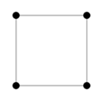
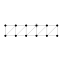
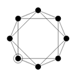

<!-- # Verlet.js -->


*Verlet.js* is a javascript library for creating rapid and fast **verlet physics** based models and structures.. Its API Is Amazing....check this out..

> **``The Awsome API``**

> **``You can create a cloth in just 3 lines of javascript``**

# Lets Get Started

## Table Of Content

* quickSetupAPI
* quickSetup Settings
* Create A Cloth In 3 Lines
* MainAPI Usage
* Verlet.Poly Objects
* Creating Your Own Models
* Render Settings
* Studio API
* Browser Support

---------------------------------------

## quickSetupAPI

Lets get startup quickly with quickSetupAPI. Its very easy to use.
The code example below shows how you can use quickSetupAPI

`quickSetupAPI automatically creates a canvas and appends it to body tag for you and initialize animation loop internally, so you dont have to worry about anything.`

check out the demo [here](./demos/quickSetup_demo.html)

```javascript
  Verlet().quickSetup(function(dots,cons) {
    this.Poly.box({},dots,cons)
  },{
    renderSettings : {
      preset : 'shadowRed'
    },
    width : 1366,
    height : 768
  })
```


## quickSetup Settings

`quickSetup is amazingly fast and easy to use. we can also include some options for our verlet engine like width,height of canvas, gravity, friction, stiffness of verlet engine. and we can also pass all Render Options through renderSettings object and where we want to append the canvas.`

### Options
properties              |  type     | defaults
------------------------|-----------|----------
id                      | *String*  | 'verlet_quick_setup'
width                   | *Number*  | bodyWidth
height                  | *Number*  | bodyHeight
append                  | *Element* | document.body
gravity                 | *Float*   | 1
friction                | *Float*   | 1
stiffness               | *Float*   | 1
renderSettings          | *Object*  | {}

check out the demo [here](./demos/quickSetup_demo.html)

```javascript
//quickSetup Settings Parameters Are Optional

Verlet().quickSetup(function(dots,cons) {
    this.Poly.cloth({},dots,cons);
  },{
    renderSettings : {
      preset : 'shadowRed'
    },
    width : 500,
    height : 500,
    gravity : 0,
    friction : 0.94,
    stiffness : 0.99,
    append : document.body
  });
```


## Create A Cloth In Just ***3 Lines Of Code***

check out the demo [here](./demos/cloth_in_three_lines.html)


```javascript
  Verlet().quickSetup(function(dots,cons) {
    this.Poly.cloth({},dots,cons)
  })
```

------------------------------------------------------------------------

quickSetup API is for getting started quickly. but its *recomended* to use **MainAPI** where ***you have more control over your app***. so lets jump over to code.

## MainAPI
##### with tons of //comments

check out the demo [here](./demos/main_api_usage.html)


### `.html`

lets add our markup first.

> Just include verlet.js in head section of your markup.

> Then add a canvas with an id.

>and we are good to go.

```html
<!DOCTYPE html>
<html lang="en">
<head>
  <title>Verlet.js API Usage</title>
  <!-- Include our awesome verlet.js -->
  <script src="js/verlet.js"></script>
</head>
<body>

  <!-- canvas element with id of "c" -->
  <canvas id="c"></canvas>

</body>
</html>
```

### `.js`

Now for our javascript

> create a new instance of Verlet with **new Verlet();** and initialize with appropriate settings in **verlet.init();**

> Then we need 2 arrays you can name whatever you want, and then create a model with **verlet.Poly.box({}, dots, cons);**

> then the main loop with
> * **verlet.frame(function,color:optional)**
> * **verlet.superUpdate(dots, cons, physicsAccuracy);**
> * **verlet.superRender(dots,cons,{});** <br>
> just call **animate();** and your very first verlet.js model is good to go. now show off your friends

```javascript
//on loaded
window.onload = function() {

  //create a new instance
  const verlet = new Verlet();

  //initialize
  // verlet.init(width, height, canvasid, gravity, friction, stiffness)
  verlet.init(500,500,'#c',1,1,1);

  // need two arrays for points and constrains
  let dots = [];
  let cons = [];

  //create a box
  //verlet.Poly.box({width,height,x,y}, cons[], dots[])
  verlet.Poly.box({},dots, cons)

  //to interact with points in realtime
  verlet.Interact.move(dots);

  //main loop
  function animate() {

    //clears and updates the canvas every time
    // verlet.frame(function,bgcolor:optional);
    verlet.frame(animate);

    //update and bake physics
    //verlet.superUpdate(dots[], cons[], physicsAccuracy)
    verlet.superUpdate(dots,cons,10);

    //finally render scene objects
    //verlet.superRender(dots[], cons[], {})
    verlet.superRender(dots,cons,renderSettings{});

  }
  animate();
}
```

------------------------------------------------------------------------

## Verlet.Poly Objects

### Creating And Modifying Poly Models

check out the demo [here](./demos/poly_objects_demo.html)

### All Poly Objects
* Verlet.Poly.box({},dots,cons)
* Verlet.Poly.triangle({},dots,cons)
* Verlet.Poly.beam({},dots,cons)
* Verlet.Poly.hexagon({},dots,cons)
* Verlet.Poly.rope({},dots,cons)
* Verlet.Poly.cloth({},dots,cons)


Poly           | Preview
 ---------------|---------
Verlet.Poly.box | 
Verlet.Poly.triangle | 
Verlet.Poly.beam | 
Verlet.Poly.hexagon | 
Verlet.Poly.rope | 
Verlet.Poly.cloth | 

```javascript
...

// If You Dont Specify Any Properties The Defaults Will Be Applied

//verlet.Poly.box({x,y,width,height}, cons[], dots[])
verlet.Poly.box({
  x : 100,
  y : 100,
  width : 100,
  height : 100,
},dots, cons);

//verlet.Poly.triangle({x,y,width,height}, cons[], dots[])
verlet.Poly.triangle({
  x : 100,
  y : 100,
  width : 100,
  height : 150
},dots, cons);

//verlet.Poly.hexagon({x,y,radius,sides,slice1,slice2,center}, cons[], dots[])
verlet.Poly.hexagon({
  x : 100,
  y : 100,
  radius : 50,
  sides : 16,
  slice1 : 1,
  slice2 : 12,
  center : true
},dots, cons);

//verlet.Poly.beam({x,y,width,height,segs}, cons[], dots[])
verlet.Poly.beam({
  x : 100,
  y : 100,
  width : 50,
  height : 50,
  segs : 10,
},dots, cons);

//verlet.Poly.rope({x,y,segs,gap}, cons[], dots[])
verlet.Poly.rope({
  x : 100,
  y : 100,
  segs : 25,
  gap : 15
},dots, cons);

//verlet.Poly.cloth({x,y,segs,gap,pinRatio}, cons[], dots[])
verlet.Poly.cloth({
  x : 100,
  y : 100,
  segs : 20,
  gap : 15,
  pinRatio : 10
},dots, cons);

...
```

------------------------------------------------------------------------

## Creating Your Own Models

now hop over to creating our own models

check out the demo [here](./demos/custom_models.html)

```javascript
window.onload = function() {
  const verlet = new Verlet();
  verlet.init(500,500,'#c',1,1,1);

  let dots = [];
  let cons = [];

  // custom points
  // [[x,y,velocityX,velocityY,pinned,color]]
  // vx,vy,pinned,color is optional
  let myModel_dots = [
    [100,100],
    [200,100],
    [200,200],
    [100,200],
  ];

  //custom constrains
  // [[index,index,hidden:Boolean]]
  // hidden is optional
  let myModel_cons = [
    [0,1],
    [1,2],
    [2,3],
    [3,0],
    [3,1],
  ];

  // and then bake the arrays 
  // verlet.bake(newDots[],newCons[],dots[],cons[])
  verlet.bake(myModel_dots,myModel_cons,dots,cons)

  verlet.Interact.move(dots)
  function animate() {
    verlet.frame(animate);

    verlet.superUpdate(dots,cons,25);
    verlet.superRender(dots,cons,{preset : 'shadowRed'});
    
  }
  animate();
}
```

------------------------------------------------------------------------ 

## Render Settings

> You can modify the default ugly look of your verlet engine through some render settings or presets

>In last parameter of superRender() use the settings and presets like shown below

check out the demo [here](./demos/render_settings_demo.html)

```javascript
...
  function animate() {
    ...

    ...

    // Tweak Render Settings
    verlet.superRender(dots,cons,{
      pointRadius : 10,
      pointColor : 'yellowgreen',
      lineWidth : 2,
      lineColor : 'green',
      renderHiddenLines : true,
      hiddenLineColor : 'red',
      hiddenLineWidth : 0.5,
      renderPointIndex : true,
      font : '12px Arial',
      fontColor : 'royalblue',
      // renderDotsAsBox : true
      // debug : true,
      // preset : 'shadowRed'
    });

    ...
  }
  animate();
...
```


### Render Options You Can Tweak

just use
> ```javascript
> verlet.superRender(dots,cons,{
>   propertyName : propertyValue
> });
>```
properties              |  type     | like this
------------------------|-----------|----------
pointRadius             | *Number*  | 5
pointColor              | *String*  | 'crimson'
lineWidth               | *Number*  | 1
lineColor               | *String*  | 'deepskyblue'
fontColor               | *String*  | 'green'
font                    | *String*  | '8px Arial'
hiddenLineWidth         | *Number*  | 1
hiddenLineColor         | *String*  | 'red'
renderDots              | *Boolean* | true
renderDotsAsBox         | *Boolean* | false
renderPointIndex        | *Boolean* | false
renderLines             | *Boolean* | true
renderPointHiddelLInes  | *Boolean* | false
debug                   | *Boolean* | false

------------------------------------------------------------------------

>### or if u r too lzy too typ (like me!)

>Use Render Presets

### Render Preset Names
* default
* shadowRed
* shadowPink
* shadowBlue
* shadowGreen

just use
> ```javascript
> verlet.superRender(dots,cons,{
>   preset : 'presetName'
> });
>```

------------------------------------------------------------------------

## StudioAPI

The MainAPI is cool. but we have some more magic in our pocket.
And its the `StudioAPI`

> You can also set up studio control panel and update settings in *realtime*

> The API is pretty simple its integrates with **MainAPI**

> There are two simple methods **Verlet.Studio.init()** and **Verlet.Studio.update()**

check out the demo [here](./demos/studio_demo.html)

```javascript
//StudioAPI
window.onload = function() {
  const verlet = new Verlet();
  verlet.init(650,350,'#c',1,1);

  const dots = [];
  const cons = [];

  verlet.Poly.hexagon({},dots,cons);

  // Initialize Controls and append it to a element
  verlet.Studio.init('#container');

  verlet.Interact.move(dots);
  function animate() {
    verlet.frame(animate);

    //update the studio
    //Verlet.Studio.update({dots[],cons[],renderSettings{}})
    verlet.Studio.update({
      dots : dots,
      cons : cons,
      renderSettings : {
        // optional and overwrites control panel settings
      }
    });

  }
  animate();
}
```

## Browser Support

### Modern HTML5 Enabled Browsers Are Ok Like.
* Mozila FireFox
* Google Chrome
* IE11 (I think? Not Tested)

### **Dont Event Think About Trying It On Old-IE**

--------------------------------------------------------

## Browse [./demos](./demos) Folder To See API Usage Demos  

> ## Contact Me
> Email Me : hazru.anurag@gmail.com
> <p>I Am A : Proud Indian<p>
> <p>And Citizen Of : Kolkata<p>
